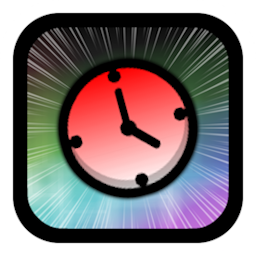

#  Speedrun Timer
Just a speedrun timer for platformer levels.

>   

>  
>  
> 

Speedrun that level!

---

### Changelog
###### What's new?!
**[📜 View the latest updates and patches](./changelog.md)**

### Issues
###### What's wrong?!
**[⚠️ Report a problem with the mod](../../issues/)**