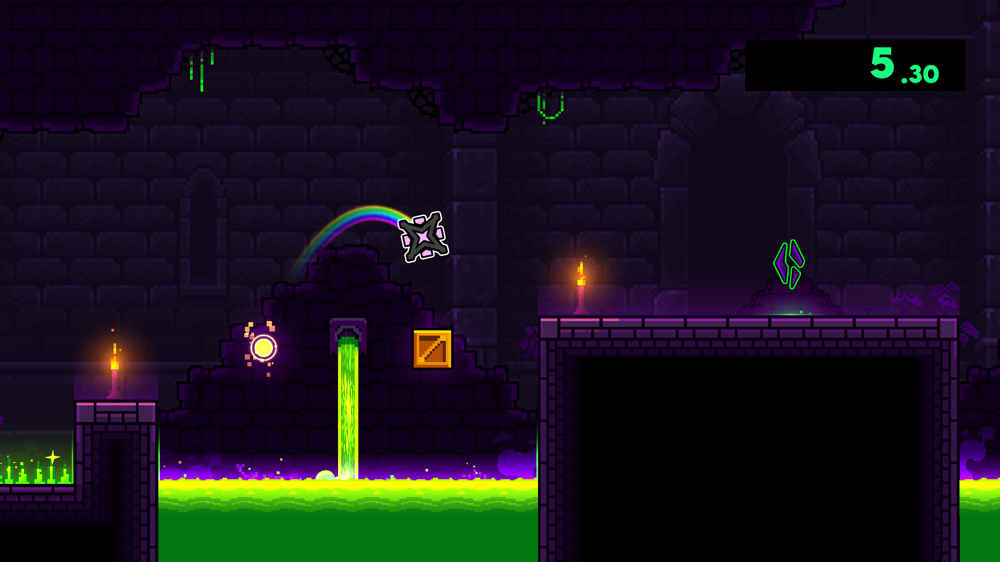
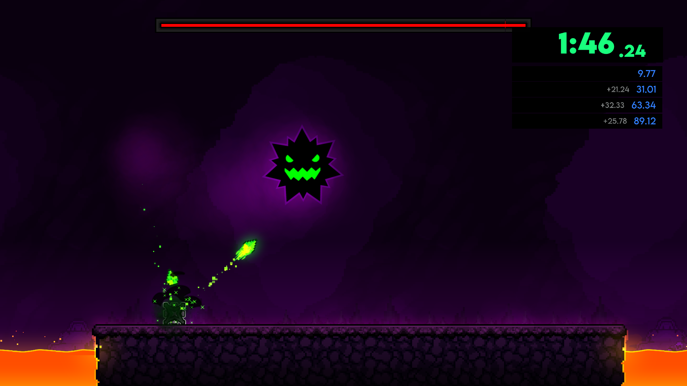

#  Speedrun Timer
Just a speedrun timer for platformer levels.

---

>   

>  
>  
> 

> [!TIP]
> *This mod has settings you can utilize to customize your experience.*

---

## About
This mod adds a speedrun timer in the style of the *[LiveSplit](https://www.livesplit.org/)* user interface to the player's level UI when playing a platformer level.

---

### Timer
A timer will appear on the top-right corner of the screen. It can be started and stopped via the play button on the top-left corner if you're on mobile, or by pressing `NumPad 1` on your keyboard, and can be fully reset by pressing `NumPad 3` or the reset button on mobile.

By default, the timer will only appear when the player is playing on a platformer level. However, this can be changed in the settings.

### Splits
You can split your ongoing run into multiple segments by pressing the checkpoint icon button on mobile or `NumPad 2` on your keyboard while the timer is running. If the timer gets fully reset, any and all splits will be removed.

When reaching checkpoints, splits may be generated automatically. This can be changed in settings.

> [!NOTE]
> *You can customize any keybinds in this mod via the *[Custom Keybinds](https://www.geode-sdk.org/mods/geode.custom-keybinds)* mod.*

---

### Credits
- **[ArcticWoof](https://www.github.com/DumbCaveSpider/)**: Playtesting & UI suggestions
- **[LiveSplit](https://www.livesplit.org/)**: Original inspiration

---

---

### Changelog
###### What's new?!
**[📜 View the latest updates and patches](./changelog.md)**

### Issues
###### What's wrong?!
**[⚠️ Report a problem with the mod](../../issues/)**